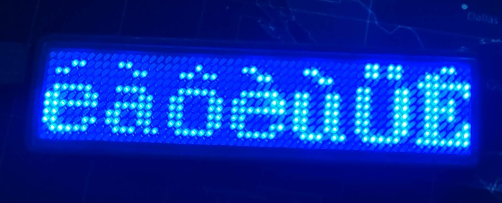

# LED Badge Controller

A web app to program LED name badges (11×44 and 12×48 LED models) directly from your browser — no software installation required.



## Features

- Up to 8 independent messages per upload
- Per-message settings: scroll mode, speed, blink, animated border (ants)
- Global brightness control (25 / 50 / 75 / 100 %)
- Live LED pixel preview while typing
- Built-in icon support: `:heart:`, `:HEART:`, `:happy:`, `:ball:`
- Works entirely in the browser via the **Web HID API** — no drivers, no Python

## Browser support

| Browser | Status |
|---------|--------|
| Chrome 89+ | Supported |
| Edge 89+ | Supported |
| Firefox | Not supported (no Web HID) |
| Safari | Not supported (no Web HID) |

## Hardware

Supported badges identify themselves on USB as:

```
idVendor=0416, idProduct=5020
LSicroelectronics LS32 Custm HID
```

Both **11×44** and **12×48** LED configurations work.

## Linux — USB access (udev rules)

By default Linux restricts raw USB/HID access to root. Run the included script once to grant your user access:

```bash
sudo ./install-udev.sh
```

Then **unplug and re-plug** the badge. The script installs a udev rule at `/etc/udev/rules.d/99-led-badge-44x11.rules` that grants read/write access to any user:

```
SUBSYSTEM=="usb", ATTRS{idVendor}=="0416", ATTRS{idProduct}=="5020", MODE="0666"
KERNEL=="hidraw*", ATTRS{idVendor}=="0416", ATTRS{idProduct}=="5020", MODE="0666"
```

To verify the rule is applied, check that `/dev/hidraw*` shows `crw-rw-rw-` permissions after re-plugging.

## Deployment (Vercel)

The app is a standard Vite + React SPA. To deploy:

1. Point Vercel at the `webapp/` directory
2. Build command: `npm run build`
3. Output directory: `dist`

A `vercel.json` with SPA rewrite rules is already included.

## Local development

```bash
cd webapp
npm install
npm run dev
```

Open [http://localhost:5173](http://localhost:5173) in Chrome or Edge.

## Project structure

```
webapp/
  src/
    lib/
      font.ts       — LED font bitmap data + icon definitions
      protocol.ts   — USB packet builder (header + bitmap encoding)
      webhid.ts     — Web HID device connection and data transfer
    components/
      MessageEditor.tsx   — text input with icon insertion
      LEDPreview.tsx      — canvas-based live pixel preview
      Settings.tsx        — speed, mode, brightness, blink, ants
      ConnectButton.tsx   — HID connection state
  public/
    icon.svg        — app icon (LED heart)
install-udev.sh     — Linux udev rules installer
99-led-badge-44x11.rules
```

## Author

**Ondrej Kolonicny** — OK1CDJ

## Support

If you find this useful, consider buying me a coffee or sending a tip via Revolut:

[](https://buymeacoffee.com/ok1cdj)
[](https://revolut.me/ok1cdj)

## Origins

This project is a browser-based rewrite of the original Python CLI tool
[led-badge-ls32](https://github.com/jnweiger/led-badge-ls32) by **jnweiger** and contributors.
The USB protocol, font bitmap data, and icon definitions were ported directly from that project.
All credit for the reverse-engineering work goes to the original authors.

## License

See [LICENSE](LICENSE).
